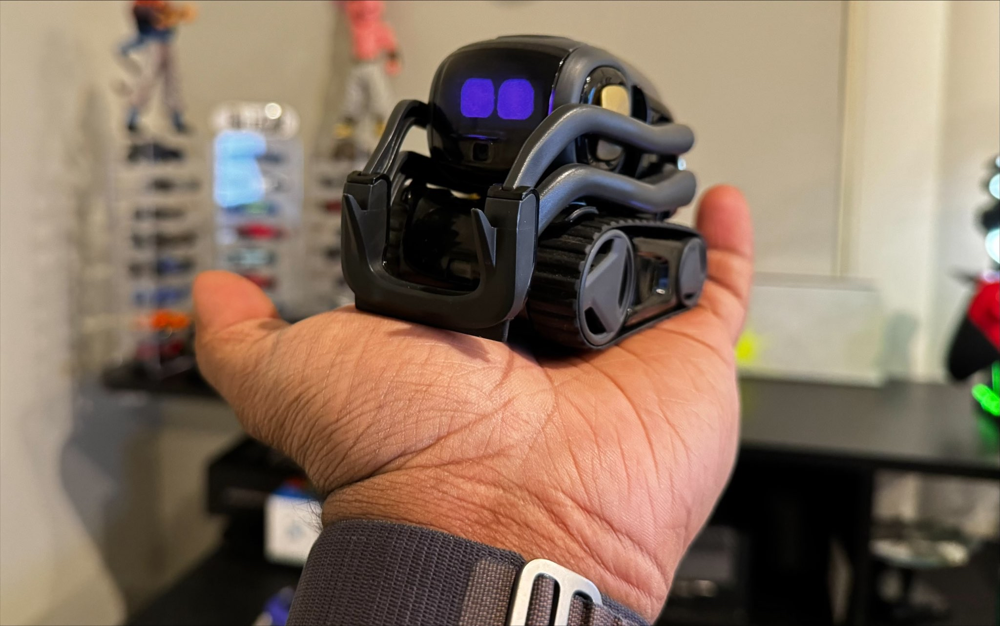

# vector-advanced-ai

> Vector with Advanced AI compatibilities — a smart Anki Vector with an LLM brain that can **see, listen, talk and act**.



## How it works

```
 Mic ──▶ Whisper STT ──▶ ┌──────────────────────────────┐ ──▶ TTS (Vector voice)
                         │   GPT brain (gpt-5.5, vision)  │
 Camera frame ─────────▶ │   src/customgpt.py            │ ──▶ @COMMAND@ intents
                         └──────────────────────────────┘      (move / emote / detect)
```

- **Listen** — `src/speechstream.py` records mic audio and transcribes it locally with Whisper.
- **Think** — `src/customgpt.py` sends the transcript (and, when asked, a live camera frame) to a vision-capable OpenAI model.
- **See** — when you say things like *"what do you see"*, *"look"*, *"read this"*, *"what colour is this"*, the app grabs a frame from Vector's camera and the model describes/reads/reasons about it in real time.
- **Act** — the model embeds `@COMMAND@` intent tokens in its reply; `app.py` strips them out and drives Vector (movement, lift, head, emotes, object detection) via the SDK.

### Behaviour

- **Wake word** — Vector ignores you until you say **"Vector"** (Vietnamese pronunciations like *véc tơ / vích to* are matched too). Whisper runs locally so listening is free; only wake-word turns hit the paid API. After replying he stays active for a few seconds so follow-ups need no wake word.
- **Autonomous agent loop** — every ~90s Vector senses his situation (battery, charger, time, idle) and the LLM decides what to do: glance around with his camera (`@LOOK@`), make a short remark, emote, or stay quiet (`@SILENT@`). It never interrupts an active conversation.
- **Vietnamese voice** — Vector thinks and replies in Vietnamese, spoken through his own speaker via OpenAI TTS (his onboard English voice can't pronounce Vietnamese). Configurable in `.env`.
- **No microphone?** — just type to Vector in the UI box; everything else (brain, voice, vision, actions) works the same.

> See `PRD.md` and `IMPLEMENTATION_PLAN.md` for the full design, research notes, and hardware verification.

### Configure the brain

Copy `.env.example` to `.env` and set your key:

```sh
cp .env.example .env
# then edit .env:
#   OPENAI_API_KEY=sk-...
#   VECTOR_GPT_MODEL=gpt-5.5   # any vision-capable model; e.g. gpt-4.1 / gpt-4o if 5.5 isn't enabled
```

`run.sh` auto-loads `.env`. The model is swappable with one line — no code change.

## Setup

### wire-pod

Anki Servers are down. You need to first setup a local server using [wire-pod](https://github.com/kercre123/wire-pod).

### vector-sdk

Setup the sdk using my [fork](https://github.com/kingardor/vector-python-sdk).

### Object Detection (Raspberry Pi Compatible)

The project now uses **Hugging Face Transformers** with OWL-ViT for zero-shot object detection, optimized for Raspberry Pi CPU execution.

Install dependencies:
```sh
pip install -r requirements.txt
```

### Installation Steps

1. Install system dependencies (Debian/Ubuntu):
```sh
sudo apt-get update
sudo apt-get install -y python3-pip python3-dev libjpeg-dev zlib1g-dev
```

2. Install Python packages:
```sh
pip install -r requirements.txt
pip install -e vector-python-sdk/
```

## Run sample

```sh
python3 app.py
```

### Performance Notes

- First run will download the OWL-ViT model (~500MB)
- Detection speed on Raspberry Pi 4: ~2-5 seconds per frame
- For faster inference, consider using smaller images or the `google/owlvit-base-patch16` model